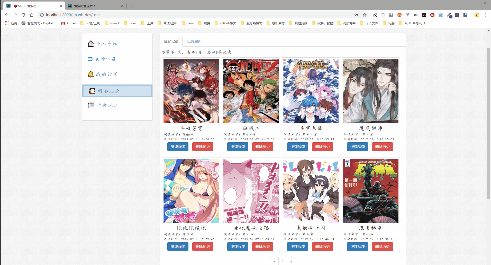

Imanb爱漫吧动漫网
====
1.项目介绍
---
利用闲暇时间整合自己学习的一些内容，做了一个动漫资源网站。动漫图片素材都来源于其他网站，不做任何商业用途，如有侵权，立刻删除。

项目初期编写前端页面用的是Bootstrap框架和Jquery，后期搭建web项目使用SSM框架进行整合并使用Thymleaf模板引擎进行页面渲染。

2.项目结构
---
项目由用户、漫画、章节、订阅、浏览历史、评论、点赞几个模块组成。

数据库文件：[Imanb.sql](imanb.sql)

3.技术架构
---
* BootStrap
* Jquery
* Thymleaf
* Spring、SpringMvc、Mybatis
* maven
* Mysql

4.页面展示
---
**前端页面**

-------------------
**管理后台页面**

5.主要功能展示
---
###用户登录###

先判断验证码是否正确，再判断用户账号密码是否正确，在判断用户是否激活（邮箱激活业务待完成） 
注册功能类似 就不多演示

用户登录效果图

###添加章节（漫画更新）###

漫画更新了章节后，与该漫画相关的漫画信息（更新最新章节），订阅信息（通知用户更新），浏览历史（通知用户更新）等信息都应该更新

后台页面效果图
一开始，该漫画的订阅和浏览历史的状态都是已读更新，添加新章节后原状态更新为已更新状态

并且漫画相关信息也更新

###更新提醒 浏览记录###

漫画更新了章节后,用户如果订阅了该漫画或者有该漫画的阅读记录，在个人中心的订阅栏中的未读更新和浏览历史中的已有更新会显示更新的漫画及章节信息 
当用户阅读完最新章节后，订阅的已有更新变为已读更新，浏览历史的已有更新浏览历史进入全部历史记录中

###浏览历史更新###

当用户登录并浏览章节信息时（不登录不会记录浏览历史），会检索用户的浏览历史，如果已存在该漫画的浏览历史，则更新浏览历史浏览时间和章节更新为即使时间，如果当前章节时最新章节则阅读状态更新为已读更新。 
如果用户不存在该浏览历史则新建浏览历史记录，再判断是否是最新章节记录浏览历史状态。

###订阅漫画###

已经订阅过的漫画不能再次订阅

###继续阅读###

用户可以在订阅信息中继续阅读订阅漫画 可以在浏览历史中继续阅读上一次阅读的章节（定位到章节）

###添加漫画###

###删除历史取消订阅###

###点赞评论###

###分类搜索###

